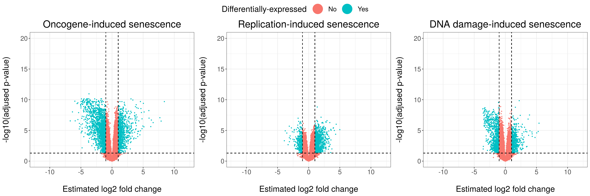
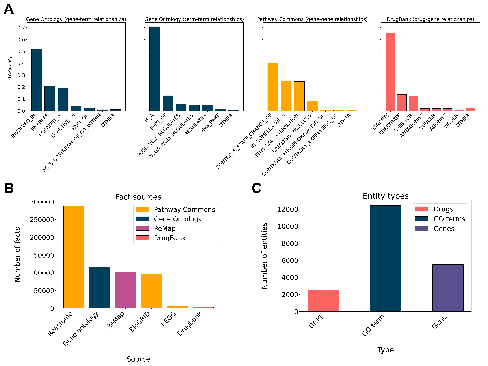
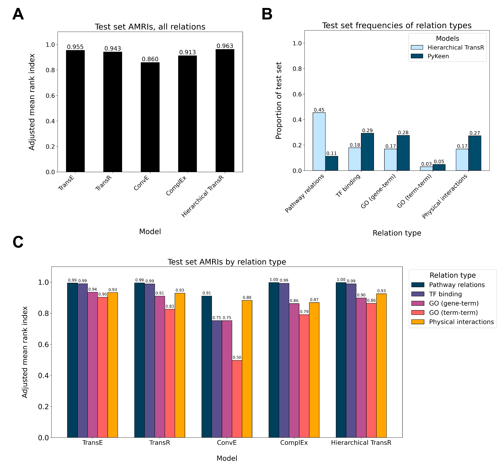

# SenescenceKG: An integrative knowledge graph of cellular senescence

## RNA-sequencing meta-analysis

The knowledge graph was constructed with genes identified from a meta-analysis of 33 
senescent/control comparisons taken from 20 experiments. All relevant files
can be found in the [`RNAseq/`](RNAseq) directory. Gene read counts and DESeq2's
estimated log fold changes and p-values are included in [`RNAseq/data`](RNAseq/data). 
To identify genes with consistent patterns of differential expression, we use
a linear mixed model to model a gene's estimated log2 fold changes, 
treating study heterogeneity as a random effect:

\
Where the random effect design matrix **Z** contains dummy variables for experiments
and the fixed effect design matrix **X** contains dummy variables for three subtypes of senescence
(oncogene-induced, replication-induced, and DNA damage-induced). 
Genes with at least one  1">
and p < 0.05 for the corresponding coefficient (shown in blue below) were added 
to the graph. 

We also add genes from four public biological databases: [CSgene](http://csgene.bioinfo-minzhao.org/),
[Ageing Atlas](https://ngdc.cncb.ac.cn/aging/index), [CellAge](https://genomics.senescence.info/cells/),
and [InnateDB](https://www.innatedb.com/).

## Constructing the graph

We integrated data from [Pathway Commons](https://www.pathwaycommons.org/), 
[Gene Ontology](http://geneontology.org/), [ReMap](https://remap.univ-amu.fr/),
and [DrugBank](https://go.drugbank.com/) into the knowledge graph, adding relations between
senescence-associated genes (identified from the RNA-sequencing analysis and
the four public gene databases). All data sets are publicly available and can be downloaded from the linked websites. 
Code used to parse the data sets and construct the graph can be found in [`KGconstruction/`](KGconstruction). 
An overview of the entities and relations present in the graph is shown below.

## Knowledge graph embedding

Knowledge graph embedding was performed with a custom model ("Hierarchical TransR") 
and four existing models from the [PyKeen](https://github.com/pykeen/pykeen) package: 
TransE, TransR, ConvE, and ComplEx. Hyperparameter searches for all models were 
implemented using [Optuna](https://github.com/optuna/optuna). 
Training was conducted on NVIDIA TITAN V (12 Gb) and NVIDIA TITAN RTX (24 Gb) GPUs. 
Models were evaluated on the test set using the [adjusted mean rank index](https://arxiv.org/pdf/2002.06914.pdf).
Results are shown below.

## Gene classification

Using the trained embeddings, gene classification models were implemented for six target variables.
Models were fit to three target variables indicating categories of expression levels in the three 
senescence subtypes and three other target variables indicating gene pathway memberships. 
Code for classification model building can be found in the [`KGanalysis/`](KGanalysis) directory.
ROC curves for all models are shown below.

